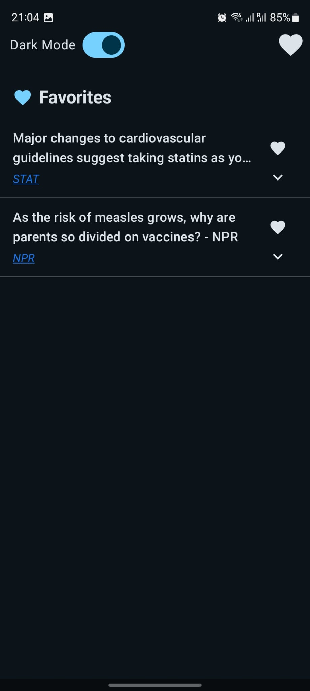
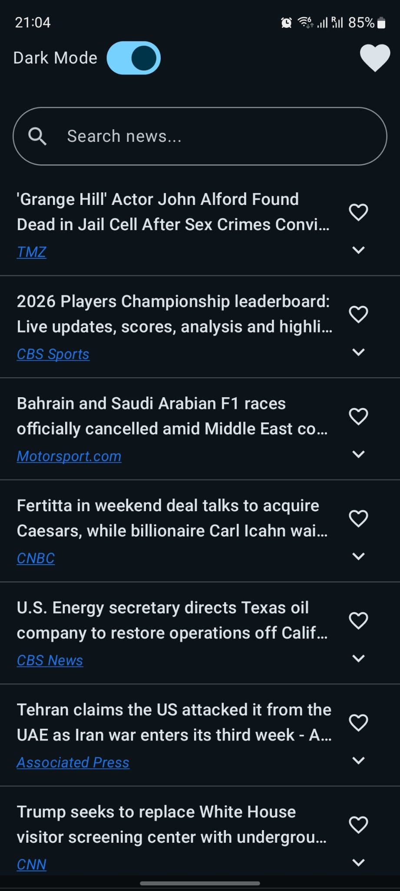

# NewsApp
The app supports the following functionalities:
1. Display top headlines
2. Scroll through the list to get more responses (limited by the subscription from the apiKey)
3. Search with keywords for news articles. Keywords matches with title, description and content.
4. Enable and diable dark mode. (Mode choice persist over multiple sessions)
5. Add and remove news articles to/from favorites.
6. View favorite news articles (top right icon).
7. Tracks user interactions to Firebase Analytics.

Here are few images from the app.

